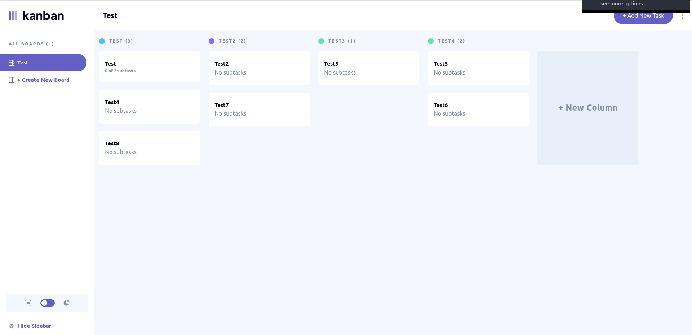

# Frontend Mentor - Kanban task management web app solution

This is a solution to the [Kanban task management web app challenge on Frontend Mentor](https://www.frontendmentor.io/challenges/kanban-task-management-web-app-wgQLt-HlbB). Frontend Mentor challenges help you improve your coding skills by building realistic projects.

## Table of contents

- [Overview](#overview)
  - [The challenge](#the-challenge)
  - [Screenshot](#screenshot)
  - [Links](#links)
- [My process](#my-process)
  - [Built with](#built-with)
  - [What I learned](#what-i-learned)
  - [Continued development](#continued-development)
  - [Useful resources](#useful-resources)
- [Author](#author)

## Overview

### The challenge

Users should be able to:

- View the optimal layout for the app depending on their device's screen size
- See hover states for all interactive elements on the page
- Create, read, update, and delete boards and tasks
- Receive form validations when trying to create/edit boards and tasks
- Mark subtasks as complete and move tasks between columns
- Hide/show the board sidebar
- Toggle the theme between light/dark modes
- **Bonus**: Allow users to drag and drop tasks to change their status and re-order them in a column
- **Bonus**: Keep track of any changes, even after refreshing the browser (`localStorage` could be used for this if you're not building out a full-stack app)
- **Bonus**: Build this project as a full-stack application

### Screenshot

### Links

- **Solution URL**: [GitHub Repository](https://github.com/TedJenkler/TodoApp-MERN-Tailwind-Typescript)
- **Live Site URL**: [Todo App](https://todoapp-mern-tailwind-typescript.onrender.com/)

## My process

### Built with

- **MERN Stack**: Utilized MongoDB, Express.js, React, and Node.js for a full-stack application.
- **Tailwind CSS**: For styling with utility-first CSS, allowing for rapid and responsive design.
- **Flexbox**: For layout and alignment of elements, ensuring a flexible and responsive design.
- **Mobile-first Workflow**: Designed with a focus on mobile devices first, then scaled up to larger screens.
- **TypeScript**: For adding static type checking to JavaScript, improving code quality and maintainability.

**Key Dependencies:**

- **React**: A JavaScript library for building user interfaces.
- **React-DND**: For drag-and-drop interactions within React components.
- **React-Router-Dom**: For handling routing and navigation in React applications.
- **Redux Toolkit**: For managing application state with a streamlined API.
- **Axios**: For making HTTP requests to the backend.
- **Express**: A web framework for Node.js, used for building the server-side application.
- **MongoDB**: A NoSQL database used for data storage.
- **Mongoose**: An ODM (Object Data Modeling) library for MongoDB and Node.js.
- **Dotenv**: For loading environment variables from a `.env` file.
- **Cors**: For enabling Cross-Origin Resource Sharing, allowing requests from different origins.
- **Morgan**: For HTTP request logging in the server.
- **Nodemon**: For automatically restarting the server during development.

### What I learned

Throughout this project, I have gained valuable insights and skills in several areas:

- **TypeScript with React**: I learned how to effectively use TypeScript in a React environment. This included understanding how to define and use types for components, props, and state, which helps in catching errors early and improving code maintainability.

- **Creating Custom Hooks**: I created my first custom hook in React. Custom hooks allow for reusable logic across different components, making the codebase cleaner and more modular. This experience has deepened my understanding of React’s hooks API and how to leverage it for better state management and side effects handling.

These learnings have significantly contributed to my growth as a developer and equipped me with new tools and techniques to apply in future projects.

### Continued development

In future projects, I plan to focus on the following areas to enhance my skills:

- **TypeScript**: I aim to improve my TypeScript proficiency as this is my first project using TypeScript. Although the current code works, I recognize the need for better TypeScript practices and cleaner type definitions. I will dedicate time to learning more about TypeScript’s advanced features and best practices to write more robust and maintainable code.

- **State Management**: Further explore and deepen my understanding of state management techniques, especially with Redux Toolkit, to handle complex state scenarios more effectively.

- **Responsive Design**: Continue refining my skills in responsive design and ensure that my applications provide a seamless experience across different devices and screen sizes.

- **Performance Optimization**: Learn more about performance optimization techniques in React and general web development to enhance the speed and efficiency of my applications.

- **Testing**: Gain more experience with testing libraries and frameworks to ensure higher quality and reliability of my code.

These areas will help me to grow as a developer and build more sophisticated and efficient applications.

### Useful Resources

- [Redux Toolkit Documentation](https://redux-toolkit.js.org/) - Comprehensive guide to using Redux Toolkit for state management in your application.
- [Tailwind CSS Documentation](https://tailwindcss.com/docs) - For styling with utility-first CSS, providing a modern approach to designing responsive and customizable interfaces.
- [React Router v6 Documentation](https://reactrouter.com/docs/en/v6/getting-started/introduction) - Essential resource for navigation and routing in React applications, helping you manage routes and navigation.
- [Stack Overflow](https://stackoverflow.com/) - A valuable community platform for support and troubleshooting various programming issues.
- [TypeScript Documentation](https://www.typescriptlang.org/docs/) - Detailed information and guides for understanding and leveraging TypeScript features and best practices.
- [YouTube](https://www.youtube.com/) - Search for tutorials and guides on React, TypeScript.

### Author

- Frontend Mentor - [@TedJenkler](https://www.frontendmentor.io/profile/TedJenkler)
- LinkedIn - [Teodor Jenkler](https://www.linkedin.com/in/tedjenklerwebdeveloper/)